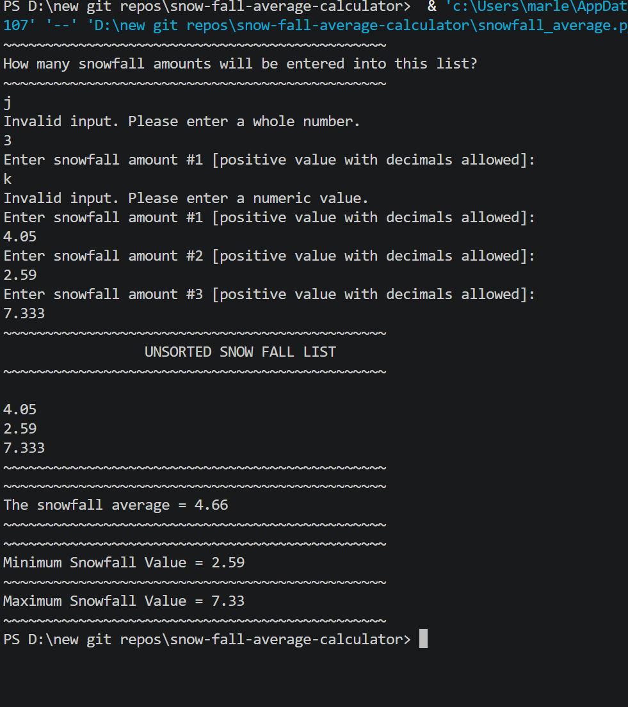

# ❄️ Snowfall Average Calculator

A Python console program that stores snowfall amounts in a **list/array**, then uses WHILE loops to calculate and display the average, minimum, and maximum snowfall values.

---

## Features

- User defines how many snowfall amounts to enter
- Stores values in a Python list (array)
- Displays the unsorted list
- Calculates and displays the average snowfall
- Finds and displays the minimum snowfall value
- Finds and displays the maximum snowfall value
- Input validation — rejects non-numeric and negative values
- Bug fix: original maximum calculation was not inside a loop — fixed with a proper while loop

---

## How It Works

1. User enters how many snowfall values to store
2. A list is created and filled via a WHILE loop
3. The unsorted list is displayed
4. A WHILE loop calculates the running sum → average is computed
5. A WHILE loop finds the minimum by comparing each element
6. A WHILE loop finds the maximum by comparing each element (bug fix)
7. Stats are displayed

---

## Example Output

```
~~~~~~~~~~~~~~~~~~~~~~~~~~~~~~~~~~~~~~~~~~~~~~
How many snowfall amounts will be entered into this list?
~~~~~~~~~~~~~~~~~~~~~~~~~~~~~~~~~~~~~~~~~~~~~~
4
Enter snowfall amount #1 [positive value with decimals allowed]:
3.5
Enter snowfall amount #2 [positive value with decimals allowed]:
7.2
Enter snowfall amount #3 [positive value with decimals allowed]:
1.8
Enter snowfall amount #4 [positive value with decimals allowed]:
5.0
~~~~~~~~~~~~~~~~~~~~~~~~~~~~~~~~~~~~~~~~~~~~~~
                 UNSORTED SNOW FALL LIST
~~~~~~~~~~~~~~~~~~~~~~~~~~~~~~~~~~~~~~~~~~~~~~
3.5
7.2
1.8
5.0
~~~~~~~~~~~~~~~~~~~~~~~~~~~~~~~~~~~~~~~~~~~~~~
The snowfall average = 4.38
~~~~~~~~~~~~~~~~~~~~~~~~~~~~~~~~~~~~~~~~~~~~~~
Minimum Snowfall Value = 1.80
~~~~~~~~~~~~~~~~~~~~~~~~~~~~~~~~~~~~~~~~~~~~~~
Maximum Snowfall Value = 7.20
~~~~~~~~~~~~~~~~~~~~~~~~~~~~~~~~~~~~~~~~~~~~~~
```

---

## Screenshot



---

## Bug That Was Fixed

The original maximum calculation was:
```python
maximum = snowfall[0]
if snowfall[count] < maximum:   # Only checked ONE element, not a loop
    maximum = snowfall[count]
```
This only checked a single element against the starting value, so the maximum was never correctly updated. Fixed with a proper `while` loop identical in structure to the minimum loop.

---

## Technologies Used

- Python 3
- Python lists (arrays) — `[0] * size` to initialize
- WHILE loops — for populating, displaying, and processing the list
- `len()` — get list length
- `try/except` — input validation

---

## Learning Outcomes

- Defining and initializing a Python list
- Using a WHILE loop as an array index counter
- Accumulator pattern with list values
- Finding minimum and maximum values with loop comparisons
- Input validation for list population

---

## How to Run

1. Make sure Python 3 is installed: https://www.python.org/downloads/
2. Clone or download this repo
3. Open a terminal in the repo folder
4. Run: `python snowfall_average.py`
5. Follow the prompts

---

## Folder Structure

```
snowfall-average-calculator/
├── snowfall_average.py
├── output.png
├── README.md
├── LICENSE
└── .gitignore
```

---

## License

This project is licensed under the MIT License — see the [LICENSE](LICENSE) file for details.

---

*Written by Marlena Fabrick — Computer Programming, Fall 2020*

